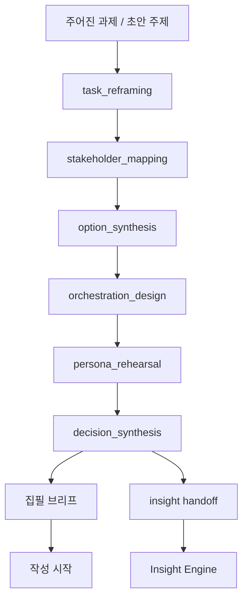
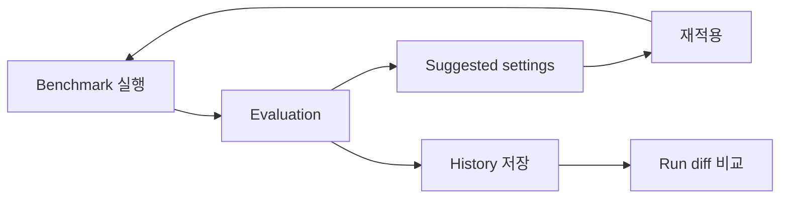
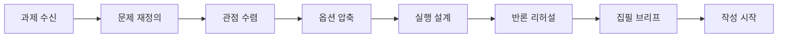

# 아키텍처: Producer Workbench First

## 현재 방향

이 프로젝트는 **글의 소비자를 위한 최종 앱**보다,
**글의 생산자(전략기획자, 리서처, 에디터, 작성자)** 를 위한 workbench를 우선한다.

즉 목표는 다음과 같다.

- 글을 쓰기 전에 질문을 다시 정의한다
- 서로 다른 관점을 한 판단 구조로 수렴한다
- AI와 사람의 역할을 설계한다
- 예상 반론을 미리 리허설한다
- 그 결과를 집필 브리프와 심화 분석 입력으로 넘긴다

## 현재 상태

```text
bullini-layer-stripping-mod/
└── src/
    ├── lib/insight/   ← 이미 정의된 이벤트를 깊게 분석하는 엔진
    └── lib/decision/  ← 쓰기 전 판단 흐름을 설계하는 엔진 (신규)
```

### `lib/insight/`가 하는 일

- Layer-stripping 분석
- 검색 + 증거 통합
- 포트폴리오 영향 해석
- 최종 output formatting

이 엔진은 **질문이 이미 어느 정도 정의된 뒤** 강하다.

### `lib/decision/`이 하는 일

- 과제 재정의
- 이해관계자 맵핑
- 선택지 수렴
- 실행 오케스트레이션
- 페르소나 리허설
- 집필/분석 handoff 생성

이 엔진은 **무엇을 질문해야 하는지 아직 흐린 상태**에서 강하다.

## 핵심 구조

```text
주어진 과제
  ↓
Decision Engine
  ↓
집필 브리프 / 분석 브리프
  ↓
(선택) Insight Engine
  ↓
심화 분석 결과
```

## Mermaid overview

### Producer-first macro flow



### Producer workbench improvement loop



### Writer-facing summary flow



## 생산자 관점의 내부 흐름

```text
[1] 과제 수신
  ↓
[2] task_reframing
  - 요청과 실제 문제를 분리
  - 숨은 전제 식별
  ↓
[3] stakeholder_mapping
  - 관점 충돌 구조화
  ↓
[4] option_synthesis
  - 선택 가능한 경로 압축
  ↓
[5] orchestration_design
  - AI / Human / Collab 역할 분배
  ↓
[6] persona_rehearsal
  - 예상 반론 / 실패 경로 시뮬레이션
  ↓
[7] decision_synthesis
  - 집필 브리프 / analysis handoff 확정
```

## 왜 consumer app 우선이 아닌가

현재 필요한 것은 다음이 아니다.

- 최종 독자용 polished 결과 페이지
- 일반 소비자에게 바로 보여줄 카드 UI
- personalized/general viewer 전환

현재 필요한 것은 다음이다.

- 생산자가 생각의 흐름을 화살표처럼 따라갈 수 있는 구조
- 작성 전에 어디서 판단이 바뀌는지 보이는 단계 구조
- AI가 대신 써주는 것이 아니라, 무엇을 어떻게 쓰게 할지 설계하는 도구

## 모듈 분리 원칙

### 공유 가능한 것

| 모듈 | 이유 |
|---|---|
| `src/lib/providers/*` | LLM / search provider 공유 가능 |
| `src/lib/cache.ts` | 공통 캐시 레이어 |
| `src/lib/insight/*` 일부 타입/유틸 | downstream 분석에 재사용 |

### producer-first로 따로 가져갈 것

| 모듈 | 이유 |
|---|---|
| `src/lib/decision/prompts.ts` | 질문 재정의 / 옵션 수렴 규칙은 insight prompt와 다름 |
| `src/lib/decision/pipeline.ts` | producer 사고 흐름 전용 순차 파이프라인 |
| `src/lib/decision/benchmarks.ts` | decision protocol 품질을 측정하는 benchmark 세트 |
| `src/lib/decision/insight-handoff.ts` | decision → insight bridge 전용 |

## UI가 붙는다면 어떤 형태여야 하는가

UI를 붙이더라도 consumer app이 아니라 producer workbench여야 한다.

```text
과제 입력
  → 재정의 결과 보기
  → 이해관계자 맵 보기
  → 옵션 비교 보기
  → 실행 설계 보기
  → 리허설 반론 보기
  → 최종 집필 브리프 확정
```

즉 화면의 목적은 “보여주기”가 아니라 “생각하게 하기”다.

## 현재 우선순위

1. decision pipeline을 fixed linear flow가 아니라 conditional / partial-safe flow로 안정화
2. benchmark / evaluate loop를 prompt tuning 제안까지 닫기
3. decision → insight handoff 연결
4. producer-facing workbench 시각화
5. 그 다음에야 필요하면 consumer-facing 산물 검토
