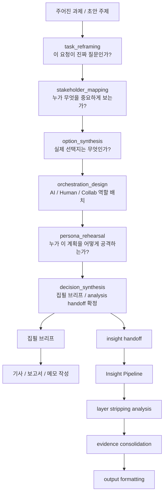
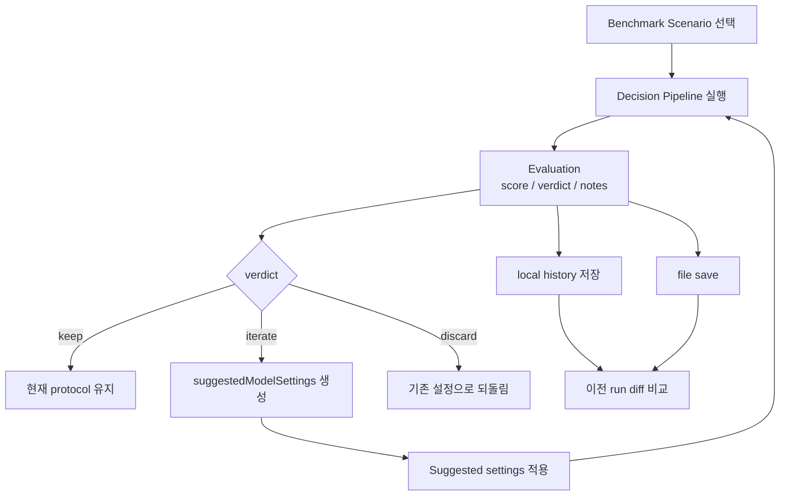

# Decision Pipeline: Overture × AUTORESEARCH

이 레이어는 기존 `src/lib/insight/*` 분석 엔진 앞단에 붙는 **생산자용 의사결정 오케스트레이션 계층**이다.

핵심 대상은 글의 **소비자**가 아니라, 글을 만들기 전에
질문을 다시 정의하고, 관점을 수렴하고, 실행 순서를 설계해야 하는 **생산자(전략기획자, 리서처, 에디터, 작성자)** 다.

## 왜 추가했는가

기존 bullini는 이미 정의된 이벤트를 깊게 분석하는 데 강하다.
하지만 Overture가 강조하는 핵심은 그보다 앞단이다.

- 지금 받은 과제가 진짜 문제인가?
- 누구의 관점이 충돌하고 있는가?
- 어떤 옵션들이 실제 선택지인가?
- 어디는 AI가 처리하고 어디는 사람이 결정해야 하는가?
- 실행 전에 누가 어떤 반론을 던질 것인가?

이 문서는 위 질문을 시스템화한 decision pipeline과,
그 decision program 자체를 반복 개선하기 위한 AUTORESEARCH-style evaluation loop를 설명한다.

## 생산자용 의사결정 흐름

```text
주어진 과제
  ↓
[task_reframing]
"이 요청이 진짜 질문인가?"
  ↓
[stakeholder_mapping]
"누가 무엇을 중요하게 보는가?"
  ↓
[option_synthesis]
"실제 선택지는 무엇인가?"
  ↓
[orchestration_design]
"AI / Human / Collab를 어떻게 배치할 것인가?"
  ↓
[persona_rehearsal]
"누가 이 계획을 어떻게 공격할 것인가?"
  ↓
[decision_synthesis]
"그래서 어떤 질문으로, 어떤 순서로, 무엇을 만들 것인가?"
  ↓
작성/분석 실행
```

이 흐름은 **글을 쓰기 전 사고 정리용 파이프라인**이다.
즉 최종 독자용 아웃풋을 예쁘게 만드는 것이 아니라,
생산자가 더 나은 질문과 더 나은 구조로 들어가게 만드는 것이 목적이다.

## 작성자 관점의 사용 흐름

```text
초안 주제 수신
  ↓
문제 재정의
  ↓
필요한 관점 수집
  ↓
핵심 논지 옵션 정리
  ↓
작성 순서 / 판단 게이트 설계
  ↓
예상 반론 리허설
  ↓
최종 집필 브리프 확정
  ↓
기사 / 보고서 / 메모 작성
```

생산자가 실제로 받는 가치는 다음과 같다.

- 바로 쓰지 않게 만든다
- 질문을 더 정확하게 만든다
- 이해관계자 관점을 한 화면의 판단 구조로 모은다
- 글의 구조와 조사 순서를 먼저 설계하게 만든다
- 반론을 미리 맞아보게 만든다

## 시스템 흐름: decision → insight

```text
기사 / 메모 / 과제 입력
  ↓
Decision Pipeline
  ├─ 과제 재정의
  ├─ 이해관계자 정리
  ├─ 옵션 수렴
  ├─ 실행 오케스트레이션
  ├─ 리허설
  └─ 집필 브리프 생성
  ↓
Insight Handoff
  ├─ recommended question
  ├─ key assumptions
  ├─ revisit triggers
  └─ analysis prompt
  ↓
Insight Pipeline
  ├─ layer stripping analysis
  ├─ evidence consolidation
  └─ output formatting
```

중요한 점은 이 구조가 **consumer app** 흐름이 아니라는 것이다.
앞단은 어디까지나 생산자의 사고를 정리하는 도구이고,
뒷단 insight pipeline은 필요할 때만 붙는 심화 분석 엔진이다.

## Mermaid workflows

### 1) End-to-end producer workflow



이 플로우는 producer-first 구조의 전체 그림이다.
앞단 decision pipeline은 글을 쓰기 전의 판단 구조를 만들고,
그 결과를 집필 브리프 또는 insight handoff로 넘긴다.

### 2) AUTORESEARCH-style improvement loop



이 플로우는 decision protocol 자체를 실험 대상으로 다루는 루프다.
즉 한 번의 실행 결과를 보는 데서 끝나지 않고,
benchmark → evaluation → suggested settings → 재실행의 반복으로 protocol을 개선한다.

### 3) Writer-facing simplified flow


이 플로우는 작성자에게 가장 직관적인 버전이다.
즉 tool 내부의 세부 구현보다,
"지금 어디까지 사고가 정리되었는가"를 빠르게 보여주는 요약 뷰로 쓸 수 있다.

## 구성 파일

- `src/lib/decision/types.ts` — decision stage / output 타입
- `src/lib/decision/prompts.ts` — decision pipeline stage prompt
- `src/lib/decision/pipeline.ts` — sequential decision pipeline runner
- `src/lib/decision/benchmarks.ts` — 기본 benchmark 시나리오
- `src/lib/decision/benchmark-runner.ts` — pipeline 실행 + 평가 결합
- `src/lib/decision/evaluate-prompt.ts` — keep / iterate / discard 판단용 evaluator
- `src/lib/decision/insight-handoff.ts` — decision output을 기존 insight dataset에 주입하는 bridge
- `app/api/decision/*` — run / evaluate / benchmark API routes

## Stage 역할

1. `task_reframing`
   - stated task와 actual decision 분리
   - 숨은 전제 드러내기
   - 추천 질문 확정
2. `stakeholder_mapping`
   - 이해관계자별 판단 기준과 tension 정리
3. `option_synthesis`
   - 실제 선택 가능한 옵션 수렴
4. `orchestration_design`
   - AI / Human / Collab 역할 분배
   - decision gate, bottleneck, stop condition 명시
5. `persona_rehearsal`
   - CFO / 법무 / 현업 / CEO 관점 공격 테스트
6. `decision_synthesis`
   - 최종 decision statement
   - meta tuning
   - downstream insight handoff 생성

## AUTORESEARCH 번역 원칙

원본 autoresearch의 핵심을 의사결정 분야에 맞게 옮겼다.

- **좁은 editable surface**: 모델 전체가 아니라 decision program을 조정한다.
- **baseline first**: 먼저 현재 decision program으로 benchmark를 돌린다.
- **keep / iterate / discard**: 개선안은 평가를 통해 남기거나 버린다.
- **simplicity wins**: 품질이 같으면 더 단순한 protocol을 채택한다.

즉 이 시스템은 단지 한 번 판단하는 엔진이 아니라,
**판단 프로토콜 자체를 연구하고 개선하는 실험 환경**이다.

## 새 실행 원칙

- 모든 stage를 무조건 강제하지 않는다. `stagePolicies`로 stage를 끄거나 optional로 둘 수 있다.
- stage 실패 시 전체를 null로 끝내지 않고, 가능한 경우 local fallback으로 partial output을 계속 만든다.
- stage 간 전달은 전체 JSON 덩어리가 아니라 다음 단계에 필요한 condensed context 위주로 전달한다.
- benchmark/evaluate 결과는 다음 런의 `suggestedModelSettings`로 되돌려 받아 prompt tuning loop를 닫는다.

## 사용 방법

### 1) Decision run

```bash
curl -X POST http://localhost:3000/api/decision/run \
  -H 'Content-Type: application/json' \
  -d '{
    "input": {
      "task": "중국 시장 검토 지시를 어떻게 재정의할지 정리하라",
      "context": ["R&D는 규격", "영업은 유통", "재무는 회수기간"],
      "stakeholders": ["CEO", "전략기획", "R&D", "영업", "재무"]
    }
  }'
```

### 2) Built-in benchmark list

```bash
curl http://localhost:3000/api/decision/benchmark
```

### 3) Benchmark run

```bash
curl -X POST http://localhost:3000/api/decision/benchmark \
  -H 'Content-Type: application/json' \
  -d '{"benchmarkId":"china-market-review"}'
```

## 기존 insight pipeline과 연결

`src/lib/decision/insight-handoff.ts`의 두 함수가 bridge 역할을 한다.

- `mergeDecisionContextIntoInsightDataset(rawJson, decisionFinalOutput)`
- `buildInsightAnalysisPromptFromDecision(decisionFinalOutput)`

즉 흐름은 다음처럼 된다.

1. 기사/이벤트를 decision pipeline으로 먼저 재정의
2. decision output에서 추천 질문 + key assumptions + revisit trigger를 추출
3. 이 맥락을 기존 `InsightDataset.additional_context`에 병합
4. 필요할 때만 기존 `runInsightPipeline`으로 deeper analysis 실행

## 다음 확장 포인트

- decision benchmark 결과를 `results.tsv` 유사 형식으로 저장
- decision prompt diff와 benchmark score를 CI gate에 연결
- plannerHistory를 장기 저장해 meta tuning 정밀도 향상
- producer workbench에서 decision pipeline → insight pipeline의 2단 구조 노출

## Field-level Validation

**Zod 스키마 기반 필드 레벨 검증 시스템입니다.**

각 decision stage는 출력 타입에 대한 엄격한 검증을 수행합니다:

```typescript
// 예시: Task Reframing 검증
export const taskReframingSchema = z.object({
  statedTask: z.string(),
  actualDecision: z.string(),
  whyNow: z.string(),
  hiddenAssumptions: z.array(hiddenAssumptionSchema),
  nonGoals: z.array(z.string()),
  reframedQuestions: z.array(decisionQuestionCandidateSchema).min(1),
  recommendedQuestion: z.string(),
});
```

검증 전략:
1. **Strict parsing**: LLM 출력을 타입에 맞게 변환
2. **Field validation**: 각 필드의 형식, 길이, 필수 여부 확인
3. **Business rule validation**: 비즈니스 로직에 맞는지 검증 (예: 최소 2개 옵션)
4. **Graceful fallback**: 검증 실패 시 local fallback으로 partial output 생성

장점:
- LLM 출력 불확실성에 대한 방어
- 구조화된 데이터 보장
- 디버깅 용이 (어떤 필드에서 실패했는지 명확)

## Version Diff 기능

**이전 버전과의 차이를 분석하여 prompt 튜닝을 지원합니다.**

`src/lib/utils/diff.ts`를 활용한 비교 기능:

```typescript
// Deep diff 비교 예시
const changes = deepDiff(previousOutput, currentOutput);
const filteredChanges = filterBenchmarkChanges(changes);
const formattedDiff = formatPath(filteredChanges[0].path);
```

비교 대상:
- **Prompt 변경**: 프롬프트 수정 시 output 변화 추적
- **Model 변경**: 다른 모델 사용 시 결과 차이 분석
- **Stage 변경**: 단계별 정책 변경 영향도 측정
- **Pipeline 변경**: 전체 플로우 수정 시 효과 분석

활용 사례:
- Benchmark 실행 결과의 점진적 개선 추적
- 특정 변경이 결과에 미친 영향 정량화
- Rollback 필요 시 변경점 식별

## Run & Apply 플로우

**Decision 실행 → 평가 → 적용의 자동화된 루프입니다.**

### 1. Run Phase

```bash
# Decision pipeline 실행
curl -X POST http://localhost:3000/api/decision/run \
  -H 'Content-Type: application/json' \
  -d '{
    "input": {
      "task": "시장 검토 과제 재정의",
      "stakeholders": ["전략", "영업", "재무"]
    }
  }'
```

### 2. Evaluate Phase

```bash
# Benchmark으로 평가
curl -X POST http://localhost:3000/api/decision/benchmark \
  -H 'Content-Type: application/json' \
  -d '{"benchmarkId":"standard-decision"}'
```

### 3. Apply Phase (자동 적용)

평가 결과에 따라 자동으로 적용되는 것들:

1. **Prompt 튜닝**: `suggestedModelSettings`가 생성됨
2. **Stage 정책**: 성능에 따라 stage 활성화/비활성화
3. **Fallback 개선**: 반복적으로 실패하는 stage의 fallback 로직 강화
4. **Meta tuning**: 다음 실행을 위한 조정 사항 반영

자동화된 플로우:

```text
Decision Run
  ↓
Evaluation (Keep/Iterate/Discard)
  ↓
Auto-apply suggested settings
  ↓
Next Run with improved settings
  ↓
History tracking & diff analysis
```

장점:
- 인간 개입 없이 지속적 개선
- 실험 결과의 누적적 활용
- 버전 관리와 롤백 기능
